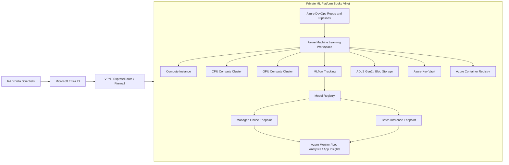
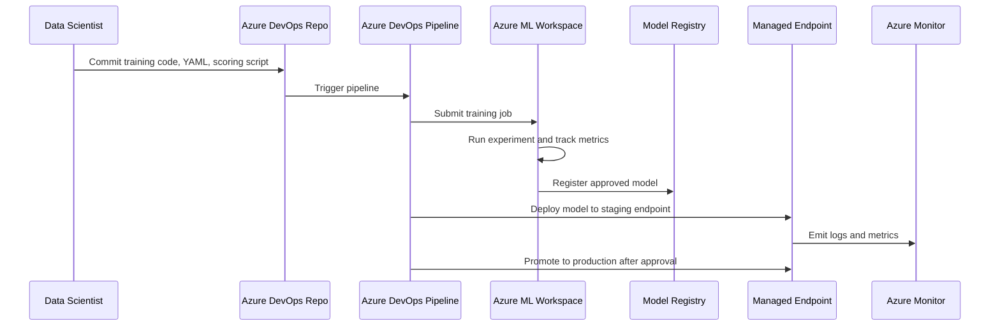

# Flora Foods R&D Azure ML Workbench - Detailed Design

## 1. Purpose

This document defines the proposed design for an Azure Machine Learning workbench for the Flora Foods R&D data science team. The design focuses on a secure, private, governed, and operationally supportable Azure ML platform integrated with Azure DevOps and the customer's existing Azure Landing Zone.

> Note: The Word document and PNG architecture diagram were generated separately in ChatGPT. This Markdown version is committed to GitHub because the current GitHub connector supports repository text updates directly. The `.docx` and `.png` files should also be committed from a local Git client or GitHub web upload.

## 2. Project Summary

| Area | Design Position |
|---|---|
| Project type | Azure ML platform/workbench setup |
| Primary users | R&D data scientists, DevOps engineers, platform administrators |
| Initial scale | Small R&D team, low to moderate data volume, limited number of models |
| Main objective | Enable secure model development, training, tracking, registration, and deployment |
| Delivery model | Azure ML + Azure DevOps + MLflow + private networking |
| Security posture | Private by design, least privilege, managed identities, Key Vault, private endpoints |

## 3. Target Architecture



## 4. Core Azure Components

### 4.1 Azure Machine Learning Workspace

The Azure ML Workspace is the control plane for experiments, jobs, compute, data assets, model registry, environments, and endpoint deployment. It should be deployed into the ML platform spoke subscription/resource group and integrated with private endpoints where supported.

### 4.2 Compute Instance

Compute Instance is used by data scientists for interactive authoring using notebooks, VS Code, and Azure ML Studio. Access should be restricted to named users. Public SSH should not be enabled.

### 4.3 Compute Clusters

Use separate clusters for CPU and GPU workloads.

| Cluster | Purpose | Design Guidance |
|---|---|---|
| CPU cluster | Standard training and jobs | Enable autoscale, low min nodes, tagged cost center |
| GPU cluster | Occasional accelerated training | Keep min nodes at 0, restrict access, monitor cost |

### 4.4 Storage

Use Azure Data Lake Storage Gen2 or Azure Blob Storage for datasets, model artifacts, outputs, and pipeline assets. Storage access should use managed identity where possible. Public network access should be disabled if the landing zone supports private access.

### 4.5 Key Vault

Azure Key Vault stores secrets, certificates, and keys needed by the ML workspace and pipelines. Avoid putting secrets in notebooks, YAML files, repo variables, or pipeline logs.

### 4.6 Azure Container Registry

Azure Container Registry stores container images used for training and inference environments. ACR should be private and integrated with the workspace.

### 4.7 Monitoring

Azure Monitor, Log Analytics, and Application Insights should capture workspace activity, endpoint telemetry, job logs, pipeline execution evidence, and operational alerts.

## 5. Security Design

| Control | Recommendation |
|---|---|
| Identity | Use Microsoft Entra ID groups mapped to Azure RBAC roles |
| Access | Apply least privilege, avoid broad Owner access |
| Secrets | Store in Key Vault, never in code |
| Network | Use private endpoints and private DNS zones where applicable |
| Data | Encrypt at rest and in transit |
| Compute | Restrict who can create GPU compute |
| DevOps | Use service connections with scoped permissions |
| Audit | Enable diagnostic settings and activity logs |

## 6. Network Design

The ML platform should run in a private spoke VNet connected to the customer hub network. Access should flow through approved enterprise network entry points such as VPN, ExpressRoute, Azure Firewall, or equivalent customer controls.

Required private endpoints may include:

- Azure ML Workspace
- Storage account
- Key Vault
- Container Registry
- Application Insights / Monitor private link scope, if used

Private DNS zones should be integrated with the hub/spoke DNS design.

## 7. MLOps Flow



Minimum viable pipeline stages:

1. Code validation and linting
2. Environment build or validation
3. Training job submission
4. MLflow tracking and metric capture
5. Model registration
6. Staging endpoint deployment
7. Smoke test
8. Manual approval
9. Production endpoint deployment
10. Monitoring and evidence capture

## 8. Azure DevOps Design

Recommended repository structure:

```text
azure-ml/
  docs/
    design/
    architecture/
    runbooks/
  infra/
    bicep-or-terraform/
  mlops/
    pipelines/
    environments/
    jobs/
    endpoints/
  src/
    training/
    scoring/
  tests/
```

Use Azure DevOps environments for approval gates. Use branch policies for protected branches. Use service connections with scoped access to the target subscription/resource group.

## 9. Deployment Targets

| Target | Purpose |
|---|---|
| Managed Online Endpoint | Real-time inference |
| Batch Endpoint | Offline/batch inference |
| Staging endpoint | Validation before production |
| Production endpoint | Business-consumable inference service |

## 10. Governance and Operations

The platform should include:

- Naming convention
- Resource tagging
- RBAC model
- Cost monitoring
- GPU spend controls
- Diagnostic settings
- Backup and recovery considerations
- Runbook and KT handover

## 11. Key Risks

| Risk | Impact | Mitigation |
|---|---|---|
| Customer access not ready | Delivery delay | Confirm access before build starts |
| Private DNS gaps | Endpoint failures | Validate DNS resolution early |
| GPU quota unavailable | Training delay | Raise quota request early |
| Data ownership unclear | Scope confusion | Define data source, owner, and access model |
| DevOps permissions missing | Pipeline delay | Validate service connection and RBAC upfront |
| Model acceptance unclear | Handover risk | Agree acceptance criteria before implementation |

## 12. Acceptance Criteria

The project should be considered ready for handover when:

- Azure ML Workspace is deployed and accessible privately
- Compute Instance is available for authorized users
- CPU and GPU compute clusters are configured
- Storage, Key Vault, ACR, and monitoring are integrated
- MLflow tracking works
- Model registry works
- One sample model can be trained, registered, and deployed
- Managed Online Endpoint works
- Batch inference path is demonstrated or documented
- Azure DevOps pipeline executes successfully
- Runbook and KT documentation are delivered

## 13. Immediate Next Steps

1. Confirm landing zone subscription, resource group, VNet, subnet, DNS, and private endpoint standards.
2. Confirm user groups and RBAC model.
3. Confirm Azure DevOps organization, project, repo, and service connection ownership.
4. Confirm GPU quota and approved VM SKUs.
5. Confirm data source, sample dataset, and model acceptance criteria.
6. Commit the generated Word document and PNG architecture diagram to GitHub using local Git or GitHub web upload.
